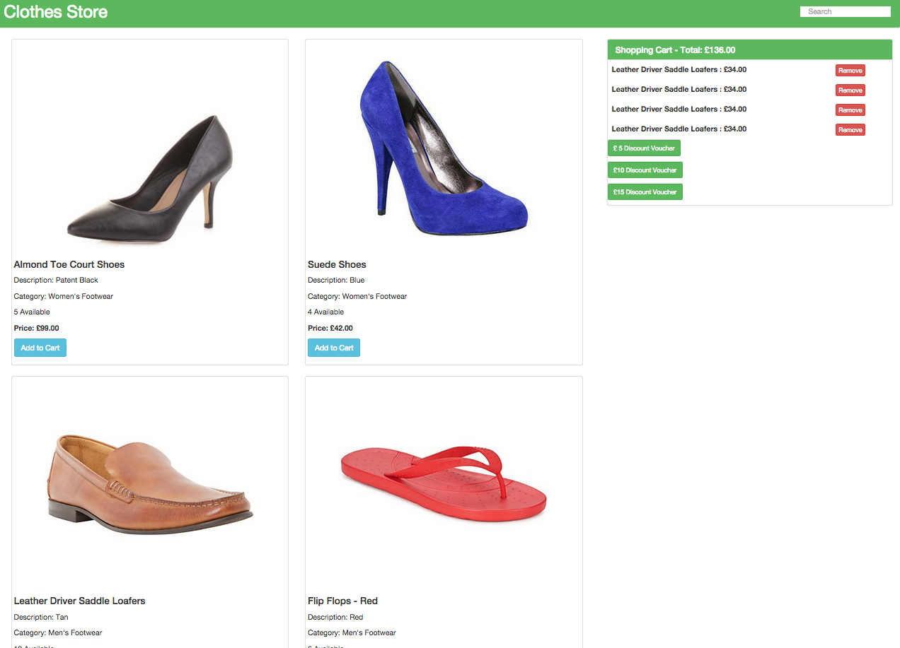

Clothes Store
============

A responsive clothing store built with AngularJS.

Screenshot
---
<div align="center">
  
</div>

Requirements
-------

- [x] As a User I can add a product to my shopping cart
- [x] As a User I can remove a product from my shopping cart
- [x] As a User I can view the total price for the products in my shopping cart
- [x] As a User I can apply a voucher to my shopping cart
- [x] As a User I can view the total price for the products in my shopping cart with discounts applied
- [x] As a User I am alerted when I apply an invalid voucher to my shopping cart
- [x] As a User I am unable to add Out of Stock products to the shopping cart
- [x] Website is responsive

Approach
--------
I decided to use AngularJS, building the app by writing feature tests with Protractor first to fulfill the requirements in the order above and Karma with Jasmine for unit testing. I wasn't sure if I should use Express as a server but decided against it to keep things simple. The product data and voucher data have been mocked in a RESTful API in separate JSON files.

Technologies used
----
- AngularJS
- NodeJS
- Karma for unit testing
- Protractor for feature testing
- HTML
- CSS
- Bootstrap
- Photoshop

File Structure
----------------
```
- app
  - js
    - app.js: Contains angular module
    - controller.js: Contains the controller
  -index.html: Contains the html layout
- test:
  - e2e
    - storeFeature.js: Contains end to end tests
  - unit
    - controller.spec.js: Contains unit tests
```

How to clone this repo
----
```sh
git clone https://github.com/kevinlanzon/clothes-store
```
Setup
-----
- Make sure you have node.js installed (run 'node -v')
- Make sure you have bower installed (run 'bower -v')
- Run npm install
- Run bower install
- Run npm start
- Visit http//localhost:8000/app

How to run tests
----
```sh
$ cd clothes-store
$ run npm start
$ npm test
$ npm run protractor
```
To do
--------
- Limit the amount of times a voucher can be used
- Update the stock count when a product has been added to the cart
- Create voucher codes to redeem a discount
- Refactor some of the html into partials
- A seperate view for the shopping cart
- Improve styling
