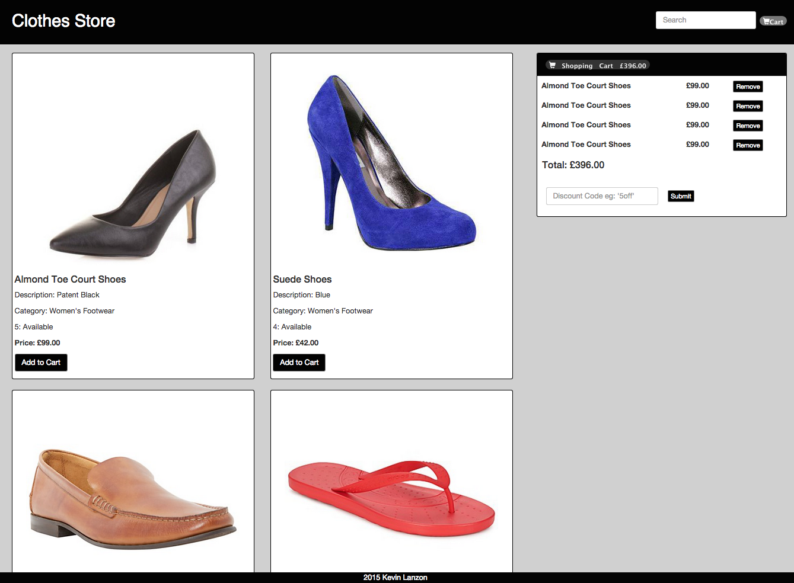

[](https://codeclimate.com/github/kevinlanzon/clothes-store)
Clothes Store
============

A responsive store for a clothing retailer built with AngularJS. The store contains six different categories of clothing and a shopping cart with the option to redeem discount vouchers.

Screenshot
---
<div align="center">
  
</div>

Requirements
-------

- [x] As a User I can add a product to my shopping cart
- [x] As a User I can remove a product from my shopping cart
- [x] As a User I can view the total price for the products in my shopping cart
- [x] As a User I can apply a voucher to my shopping cart
- [x] As a User I can view the total price for the products in my shopping cart with discounts applied
- [x] As a User I am alerted when I apply an invalid voucher to my shopping cart
- [x] As a User I am unable to add Out of Stock products to the shopping cart
- [x] Website is responsive

Approach
--------
I decided to use AngularJS, building the app by writing feature tests with Protractor first to fulfill the requirements in the order above and Karma with Jasmine for unit testing. I wasn't sure if I should use Express as a server but decided against it to keep things simple. The product data has been mocked in a RESTful API and the discounts can be applied by entering voucher codes for each offer. The codes are **5off**, **10off** and **15off**.

Technologies used
----
- AngularJS
- Node.js
- Express.js
- Karma for unit testing
- Protractor for feature testing
- HTML
- CSS
- Bootstrap
- Photoshop

File Structure
----------------
```
- app
  - css
    - app.css
    - bootstrap.min.css
  - images
  - js
    - app.js: Contains angular module
    - storeController.js: Contains the controller
  - partials
    - store.html: Contains the homepage layout
  - products
    - productList.json: Contains the product data
  - index.html: Contains the main html
- test
  - e2e
    - storeFeature.js: Contains end to end tests
  - unit
    - storeController.spec.js: Contains unit tests
```

How to clone this repo
----
```sh
git clone https://github.com/kevinlanzon/clothes-store
```
Setup
-----
```sh
$ npm install
$ bower install
$ npm start
Visit http//localhost:3000
```

How to run tests
----
```sh
$ cd clothes-store
$ npm start
$ npm test
$ npm run protractor
```
Voucher Codes
----
- For £ 5.00 off your order use **5off**
- For £10.00 off your order when you spend over £50 use **10off**
- For £15.00 off when you spend over £75 and you have bought at least one item of footwear use **15off**

To do
--------
- Refactor the voucher discount into a single method
- A separate view for the shopping cart
- Clear the discount form after a voucher code has been applied
- Improve styling